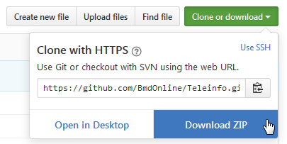

# Sommaire
* [Installation](#installation)
    * [Version actuelle] (#version-actuelle)
    * [Version dev] (#version-dev)
    * [Liste des versions] (#liste-des-versions)
* [Configuration](#configuration)
    * [Accès MySQL] (#accès-mysql)
    * [Table téléinfo] (#table-téléinfo)
    * [Librairie graphique] (#librairie-graphique)
* [Paramètres](#paramètres)
    * [Puissance apparente - Puissance active] (#puissance-apparente---puissance-active)
    * [Gauge instantanée] (#gauge-instantanée)
        * [Donnée à afficher] (#donnée-à-afficher)
        * [Rafraichissement automatique] (#rafraichissement-automatique)
        * [Aspect des gauges] (#aspect-des-gauges)
    * [Aperçu quotidien] (#aperçu-quotidien)
    * [Historiques] (#historiques)
        * [Affichage 3D] (#affichage-3d)
        * [Type de graphique] (#type-de-graphique)
        * [Période précédente] (#période-précédente)
    * [Couleur des graphiques] (#couleur-des-graphiques)
* [Tarifs EDF] (#tarifs-edf)

# Installation
## Version actuelle
Deux possibilités :
* Utiliser l'utilitaire `git` pour dupliquer le dépôt :
```bash
git clone git://github.com/BmdOnline/Teleinfo.git
```

* Télécharger et décompressez l'archive zip à partir de l'interface `github` :



* Lien direct de l'archive :
    * https://github.com/BmdOnline/Teleinfo/archive/master.zip
    * https://github.com/BmdOnline/Teleinfo/archive/master.tar.gz

Vous avez maintenant une copie locale du dépôt distant.

## Version dev
Deux possibilités :
* Utiliser l'utilitaire `git` pour dupliquer le dépôt :
```bash
git clone -b dev git://github.com/BmdOnline/Teleinfo.git
```

* Lien direct de l'archive :
    * https://github.com/BmdOnline/Teleinfo/archive/dev.zip
    * https://github.com/BmdOnline/Teleinfo/archive/dev.tar.gz

## Liste des versions

| Version | Lien |
| ------------- | ------------- |
| dev | https://github.com/BmdOnline/Teleinfo/archive/dev.zip <br> https://github.com/BmdOnline/Teleinfo/archive/dev.tar.gz |
| stable | https://github.com/BmdOnline/Teleinfo/archive/master.zip <br> https://github.com/BmdOnline/Teleinfo/archive/master.tar.gz |
| | |
| v4.5.1 | https://github.com/BmdOnline/Teleinfo/archive/v4.5.zip <br> https://github.com/BmdOnline/Teleinfo/archive/v4.5.1.tar.gz |
| v4.5 | https://github.com/BmdOnline/Teleinfo/archive/v4.5.zip <br> https://github.com/BmdOnline/Teleinfo/archive/v4.5.tar.gz |
| v4.4dev | https://github.com/BmdOnline/Teleinfo/archive/v4.4dev.zip <br> https://github.com/BmdOnline/Teleinfo/archive/v4.4dev.tar.gz |
| v4.3 | https://github.com/BmdOnline/Teleinfo/archive/v4.3.zip <br> https://github.com/BmdOnline/Teleinfo/archive/v4.3.tar.gz |
| v4.2dev | https://github.com/BmdOnline/Teleinfo/archive/v4.2dev.zip <br> https://github.com/BmdOnline/Teleinfo/archive/v4.2dev.tar.gz |
| v4.1dev | https://github.com/BmdOnline/Teleinfo/archive/v4.1dev.zip <br> https://github.com/BmdOnline/Teleinfo/archive/v4.1dev.tar.gz |
| v4.0 | https://github.com/BmdOnline/Teleinfo/archive/v4.0.zip <br> https://github.com/BmdOnline/Teleinfo/archive/v4.0.tar.gz |
| v3.0 | https://github.com/BmdOnline/Teleinfo/archive/v3.0.zip <br> https://github.com/BmdOnline/Teleinfo/archive/v3.0.tar.gz |
| v2.0 | https://github.com/BmdOnline/Teleinfo/archive/v2.0.zip <br> https://github.com/BmdOnline/Teleinfo/archive/v2.0.tar.gz |
| v1.0 | https://github.com/BmdOnline/Teleinfo/archive/v1.0.zip <br> https://github.com/BmdOnline/Teleinfo/archive/v1.0.tar.gz |

# Configuration
## Accès MySQL
Pour commencer, il est nécessaire de définir l'accès à la base MySQL et à la table Téléinfo.
Dans le fichier `config.php`, il faut adapter ces quelques lignes
```php
/***********************/
/*    Données MySQL    */
/***********************/
$db_connect = array (
    "serveur" => "localhost",
    "base"    => "teleinfo",
    "table"   => "tbTeleinfo",
    "login"   => "teleinfo",
    "pass"    => "teleinfo"
);
```

## Table téléinfo
Selon le système utilisé, la table MySQL peut avoir des formats différents.
Ce programme est fait pour s'adapter à différentes structures de données.

### Choix d'un modèle défini
Quelques modèles type sont proposés :

| | Format 1 | Format 2 | Format 3 |
| ------------- | ------------- | ------------- | ------------- |
| Type de date | Date | Timestamp | Timestamp |
| | | | |
| DATE | Date | Timestamp | FTimestamp |
| REC_DATE | Non | Oui | Oui |
| REC_TIME | Non | Oui | Oui |
| Noms | IINST1 | INST1 | IINST |
| DEMAIN | Oui | Non | Non |
| | | | |
| OPTARIF HC | HC.. (points) | HC.. (points) | HC.. (points) |
| PTEC HC/HP | HC.. / HP.. (points) | HC / HP (sans points) | HC / HP (sans points) |
| | | | |
| Modèle | structure.date.php | structure.timestp.php | structure.ftimestp.php |

Dans le fichier `config.php`, il faut adapter ces quelques lignes
```php
/************************/
/*    Table TéléInfo    */
/************************/
// Selon la configuration de la base de données téléinfo,
//   choisir la structure à utiliser :
// - structure.date.php
// - structure.timestp.php
// - structure.ftimestp.php
// Il est également possible de se créer une structure personnalisée
// - structure.custom.php (par exemple)
include_once("structure.date.php");
```

A partir de là, le programme est opérationnel.

## Librairie graphique
Il est possible de choisir la librairie qui affichera les graphiques.

Les librairies proposées sont :

| | Lien | Licence | 3D | Faiblesse |
| ------------- | ------------- | ------------- | ------------- | ------------- |
| HighCharts | [:earth_africa:] (http://www.highcharts.com) | propriétaire | oui | Licence propriétaire |
| JQPlot | [:earth_africa:] (http://www.jqplot.com) | MIT/GPLv2 | non | Redimensionnement mal géré |
| Flot | [:earth_africa:] (http://www.flotcharts.org) | MIT | non | Légende sur plusieurs lignes n'ajuste pas le graphique |

Le choix se fait dans le fichier `js/teleinfo.js` où il faut adapter ces quelques lignes.

Pour utiliser HighCharts :
```js
jQuery(function ($) {
    "use strict";

    // Do something here
    modChart = modHighCharts;
    //modChart = modJQPlot;
    //modChart = modFlot;
});
```

Pour utiliser JQPlot :
```js
jQuery(function ($) {
    "use strict";

    // Do something here
    //modChart = modHighCharts;
    modChart = modJQPlot;
    //modChart = modFlot;
});
```

Pour utiliser Flot :
```js
jQuery(function ($) {
    "use strict";

    // Do something here
    //modChart = modHighCharts;
    //modChart = modJQPlot;
    modChart = modFlot;
});
```

Actuellement, toutes les librairies nécessaires sont chargés (dans le fichier HTML).

Afin de consommer moins de ressources, il est possible de supprimer/commenter les chargements de librairies non utilisées.

### Table personnalisée
Si aucun des modèles proposés ne convient, il est tout à fait possible d'en créer un personnalisé.
Le plus simple est de partir d'un modèle existant et de le modifier.

#### Format de date MySQL
Selon l'utilitaire collectant les données téléinformation, la base peut utiliser un format de date différent (date ou timestamp).
Attention à la casse (majuscule / minuscule) !
```php
$config_table = array (
    // Quelques informations sur la configuration
    "type_date" => "date", // "date" ou "timestamp" selon le type de stockage de la date
    // Nom des champs de la table.
    //   Clé    = nom interne au programme : NE PAS MODIFIER
    //   Valeur = nom du champ dans la table téléinfo
    // Adapter les valeurs du tableau si le nom du champ est différent
    "table" => array (
        "DATE"     => "DATE",    // => vaut soit "DATE", soit "TIMESTAMP"
        //...//
```

#### Nom des champs Teleinfo
Selon l'utilitaire collectant les données téléinformation, la base peut utiliser des noms différents.
Attention à la casse (majuscule / minuscule) !
```php
    // Nom des champs de la table.
    //   Clé    = nom interne au programme : NE PAS MODIFIER
    //   Valeur = nom du champ dans la table téléinfo
    // Adapter les valeurs du tableau si le nom du champ est différent
    "table" => array (
        "DATE"     => "DATE",    // => vaut soit "DATE", soit "TIMESTAMP"
        //...//
        "IINST1"   => "IINST1",  // => vaut soit "IINST1" soit "INST1"
        //...//
```

# Paramètres
## Puissance apparente - Puissance active
Dans le cas de faible consommation (<~180w), la puissance apparente (PAPP) de certains relevés téléinfo ne serait pas pertinente.
Lors de relevés téléinfo avec une fréquence réduite, la pertinence de la puissance apparente peut se poser.

Il est alors possible de recalculer la puissance active, en se basant sur l'index relevé.
Ce résultat, bien qu'approximatif (impact du cos phi), peut s'avérer préférable à la puissance apparente.

L'option se situe dans le fichier `config.php` :
```php
/*******************************/
/*    Données EDF & Téléinfo   */
/*******************************/
//...//
$config["recalculPuissance"]     = false; // true : calcule la puissance en se basant sur le relevé d'index plutôt que PAPP
```

## Gauge instantanée
### Donnée à afficher
Il est possible d'afficher une ou deux gauges.
Dans le cas d'une seule gauge affichée, c'est la puissance qui est sélectionnée.
Dans le cas de deux gauges, l'intensité s'affichera à côté.

L'option se situe dans le fichier `config.php` :
```php
$config["graphiques"]["instantly"] = array(
    //...//
    "doubleGauge"  => true,      // true : affiche intensité en plus de la puissance
    //...//
```

### Relevé de l'index du compteur
Il est possible d'afficher l'index du compteur, pour faciliter le relevé EDF.

L'option se situe dans le fichier `config.php` :
```php
    $config["afficheIndex"]          = true;  // true : affiche les index pour chaque période tarifaire (relevé de compteur EDF)
```

### Rafraichissement automatique
Il est possible d'activer ou désactiver le rafraichissement automatique des gauges.

L'option se situe dans le fichier `config.php` :
```php
$config["graphiques"]["instantly"] = array(
    //...//
    "refreshAuto"  => true,      // active le rafraichissement automatique
    "refreshDelay" => 120,       // relancé toutes les 120 secondes
    //...//
```

### Aspect des gauges
Il est possible de modifier les différents seuils des gauges, ainsi que les couleurs associées.

Les options se situent dans le fichier `config.php` :
```php
// couleurs des bandes des gauges
$config["graphiques"]["instantly"] = array(
    //...//
    "bands" => array(            // couleurs des bandes des gauges
        "W" => array(            // Puissance
            300   => "#55BF3B",  // de 0 à 300
            1000  => "#DDDF0D",  // de 300 à 1000
            3000  => "#FFA500",  // de 1000 à 3000
            10000 => "#DF5353"   // supérieur à 3000
        ),
        "I" => array(            // Intensité
            2   => "#55BF3B",    // de 0 à 2
            5   => "#DDDF0D",    // de 2 à 5
            13  => "#FFA500",    // de 5 à 13
            100 => "#DF5353"     // supérieur à 20
        )
    )
    //...//
```

## Aperçu quotidien
Ce graphique ne propose aucun réglage spécifique.

## Historiques
### Affichage 3D
Il est possible de choisir un affichage 2D ou 3D des histogrammes (uniquemement avec HighCharts).
Cette option semble avoir quelques défauts d'affichage.

Défaut constatés :
* Les valeurs affichées sur les barres de l'histogramme sont parfois mal positionnées.
* La courbe de période précédente s'affiche derrière l'histogramme au lieu de s'afficher devant.

L'option se situe dans le fichier `config.php` :
```php
$config["graphiques"]["history"] = array(
    "show3D"     => true,       // true : affiche le graphique en 3D
    //...//
```

### Type de graphique
Il est possible de choisir le type de représentation des séries de données.
Certaines combinaisons n'ont pas de sens ou sont mal gérées par HighCharts.
A vous de tester...

Les options se situent dans le fichier `config.php` :
```php
$config["graphiques"]["history"] = array(
    //...//
    "typeSerie"  => "column",    // Type de graphique pour les séries de données (syntaxe HighCharts)
    "typePrec"   => "spline",    // Type de graphique pour les périodes précédentes (syntaxe HighCharts)
    //...//
```

### Période précédente
Il sera possible de choisir entre un affichage simple ou détaillé des données de la période précédente.

Les options se situent dans le fichier `config.php` :
```php
$config["graphiques"]["history"] = array(
    //...//
    "detailPrec" => false,       // true : détaille les différentes périodes tarifaires pour les périodes précédentes
    //...//
```

Cette option n'est pas encore implémentée.

## Couleur des graphiques
Chaque donnée affiché en graphique a une couleur paramétrable.

Pour changer les couleurs, il faut adapter le fichier `config.php` :
```php
// couleurs de chacune des séries des graphiques
$teleinfo["COULEURS"] = array(
    "MIN"  => "green",   // Seuil de consommation minimale sur la période
    "MAX"  => "red",     // Seuil de consommation maximale sur la période
    "PREC" => "#DB843D", // Période précédente
    "BASE" => "#2f7ed8",
    "HP"   => "#c42525",
    "HC"   => "#2f7ed8",
    "HPJB" => "#2f7ed8",
    "HPJW" => "#8bbc21",
    "HPJR" => "#910000",
    "HCJB" => "#77a1e5",
    "HCJW" => "#a6c96a",
    "HCJR" => "#c42525",
    "HN"   => "#2f7ed8",
    "HPM"  => "#c42525",
    "I"    => "blue"     // Intensité
);
```

# Tarifs EDF
Le fichier `tarifs.php` contient l'historique de tous les tarifs EDF pour chaque formule.
Les données sont nationales et communes pour tout le monde, sauf certaines taxes locales.
* Pour un calcul plus juste, il est nécessaire d'adapter la `TCFE`.
* A chaque évolution tarifaire, il est nécessaire d'ajouter les nouveaux tarifs dans le fichier.

