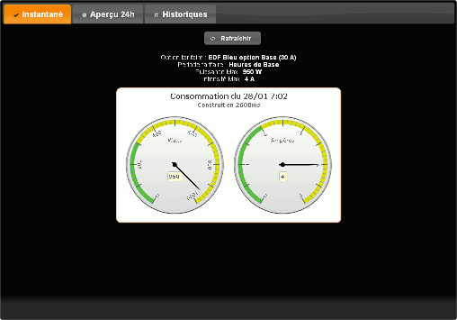

# Graphique Conso Electrique Téléinfo EDF avec Highcharts

# Présentation
Ceci est une application WEB permettant de visualiser sous forme de graphique les relevés EDF fournis par l'interface téléinfo.

La présentation s'adapte automatiquement aux smartphones & tablettes.

Il faut, au préalable, disposer d'une base de donnée MySQL contenant les relevés Téléinfo.

Vous trouverez toute la documentation nécessaire à la collecte tééinfo à l'aide de votre moteur de recherche favori.
Cet aspect technique ne sera pas évoqué et aucun support ne sera fourni ici.

# Pré-requis
* Serveur Web (testé avec Apache, serveurs type Nginx… non testés)
* PHP (testé avec versions 5.4, 5.5, 5.6 et 7.0.4)
* MySQL / MariaDB (testé avec versions 5.0 et 5.5 et 5.7.1)
* Enfin, un compteur EDF avec l'option téléinfo et les relevés correspondants.

# Sommaire
* [Installation](INSTALL.md) : Installation, configuration et paramétrage du programme.
* [Personnalisation](THEMES.md) : Personnalisation de l'interface, utilisation de templates et thèmes.
* [Copies d'écran](SCREENSHOTS.md) : Quelques copies d'écran illustrant les fonctions et différents thèmes du programme.
* [Changements] (CHANGELOG.md) : Historique des versions.