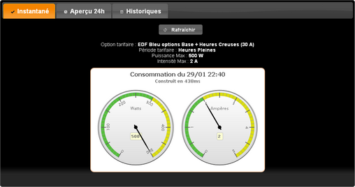
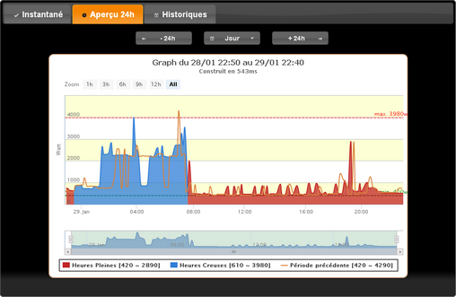

# Copies d'écran

* Onglet _Puissance Instantanée_

* Onglet _Consommation Actuelle_

* Onglet _Données Historiques_ (2D)

* Onglet _Données Historiques_ (3D)

* Formule de base
    * [Affichage simple] (teleinfo/base_single.png)
    * [Onglet _Instantané_] (teleinfo/base_tab_inst.png)
    * [Onglet _24h_] (teleinfo/base_tab_day.png)
    * [Onglet _Historique_] (teleinfo/base_tab_hist.png)
    * [Onglet _Historique_ (3D)] (teleinfo/base_tab_hist_3D.png)

* Formule HP/HC
    * [Onglet _Instantané_] (teleinfo/hphc_tab_inst.png)
    * [Onglet _24h_] (teleinfo/hphc_tab_day.png)
    * [Onglet _Historique_] (teleinfo/hphc_tab_hist.png)
    * [Onglet _Historique_ (3D)] (teleinfo/hphc_tab_hist_3D.png)

* Formule Tempo
    * [Onglet _Instantané_] (teleinfo/tempo_tab_inst.png)
    * [Onglet _24h_] (teleinfo/tempo_tab_day.png)
    * [Onglet _Historique_] (teleinfo/tempo_tab_hist.png)
    * [Onglet _Historique_ (3D)] (teleinfo/tempo_tab_hist_3D.png)

* Version Mobile
    * [Affichage simple] (teleinfo/mobile_single.png)
    * [Onglet _Instantané_] (teleinfo/mobile_tab_inst.png)
    * [Onglet _24h_] (teleinfo/mobile_tab_day.png)
    * [Onglet _Historique_] (teleinfo/mobile_tab_hist.png)

* Thèmes
    * [Thème _ui-darkhness_] (teleinfo/theme_ui-darkness.png)
    * [Thème _ui-lightness_] (teleinfo/theme_ui-lightness.png)
    * [Thème _smoothness_] (teleinfo/theme_smoothness.png)
